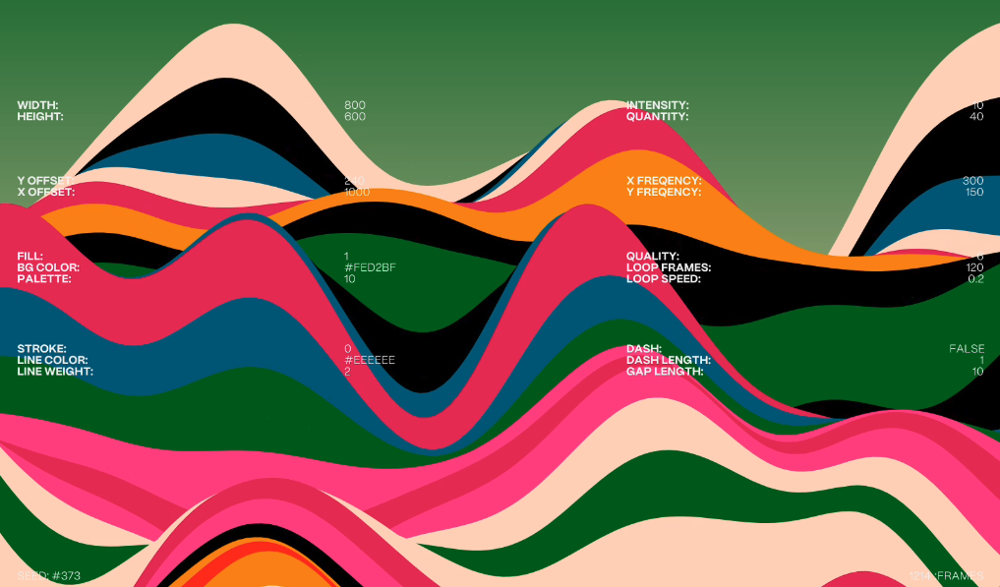
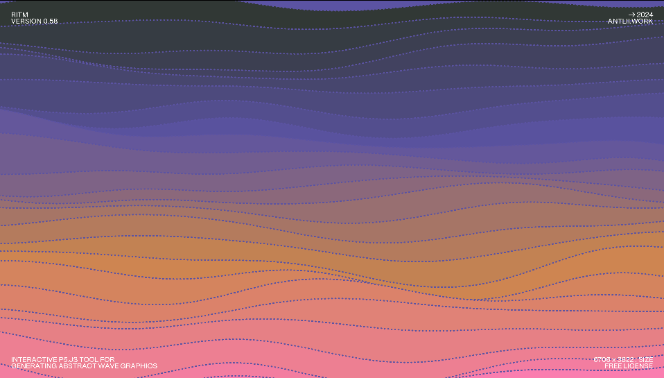
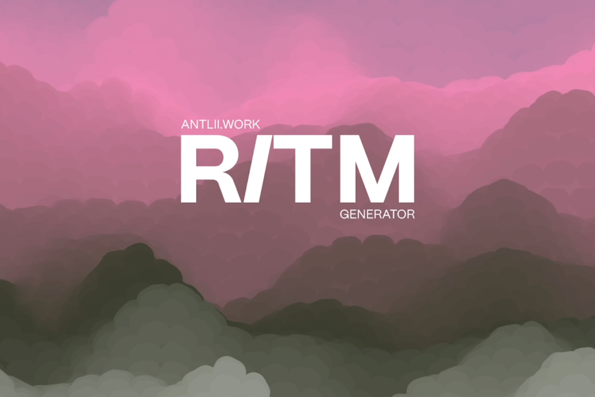

# Quiz8 KaiqiXie

## Part 1: Inspiration 
 
I find my inspiration mainly from the works of *Anatolii Babii*. He has developed the **RITM-Generator**, an interactive procedural tool capable of creating various wavelike visual images. The generator offers interactive controls for random colour changes and adjustments in wave size. 

Apart from waves, *Anatolii* also showcased animations that make clouds and mist undulate using similar techniques. 

I would like to apply an effect similar to undulating texture waves to the assignment. This would add dynamic effects while preserving the overall image structure. Moreover, it would enable user interaction, such as making clouds surge or altering facial expressions. 

## Part 2: Coding Technique Exploration 

For implementing the wavelike visual effect inspired by *Anatolii Babii*'s work, I found a coding technique called **Perlin Noise**, which can generate smooth, continuous random variations, allowing us to create undulating waves. 

Here's an example in p5.js: [Noise-Wave](https://p5js.org/examples/math-noise-wave.html). 

In this example, `noise` is used to calculate varying `y-coordinate` values based on the input `x-coordinate` values. With the `x-coordinate` values incrementally adjusted within a `for loop`, multiple vertical lines are drawn on a canvas to create a series of waves.

  

Fine-tuning parameters of the `noise` function allows for generating basic multilayered wave effects, enabling me to create dynamic and visually appealing textures.

